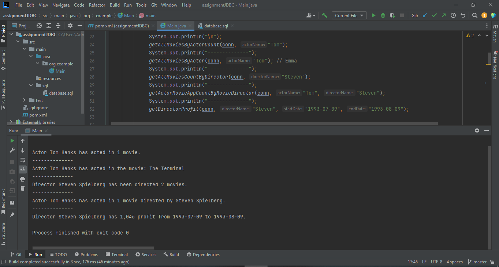
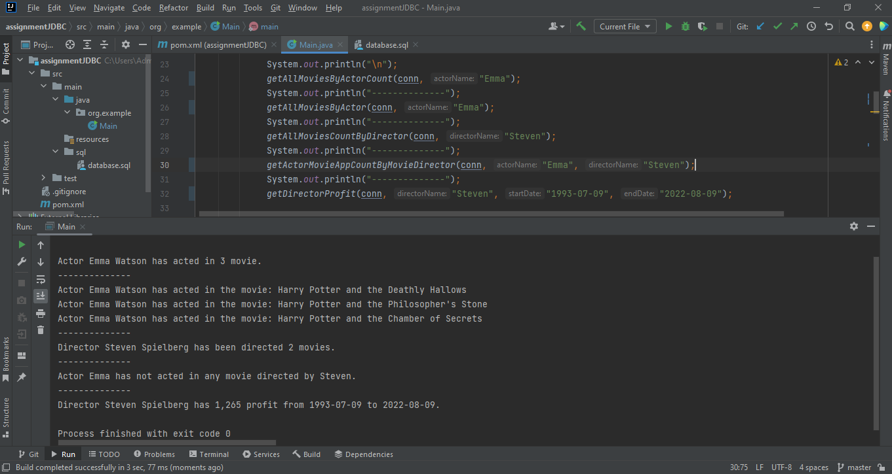

# assignmentJDBC

##This Java project is simple MySQL database learning project. 
In this Java project, the focus is on learning about MySQL databases by using stored procedures.


## Features:
- getActorMovieAppearances - returns the number of movies the actor has acted
- getAllMoviesByActor - returns all movies the actor has acted
- getAllMoviesCountByDirector - returns the number of movies the director has directed
- getActorMovieAppCountByMovieDirector - returns the number of movies the actor has appeared, directed by a specific director
- getDirectorProfit - returns the profit made by a director within a specific period

## Project screenshots

*Console Output*
<div>
  
 </div>
 
 *Console Output*
<div>
  
</div>

## Setup Instructions:

* Import the project into your preferred Java IDE.
* Update the database connection URL, username and password in the main method in the Main class to match your MySQL database settings.
* Create a MySQL database with the name java_class_db (you can change the name in the code if needed).
```
 try {
       conn = DriverManager.getConnection("jdbc:mysql://127.0.0.1:3306/java_class_db", "YOUR_USERNAME", "YOUR_PASSWORD");
}catch (SQLException ex){
       ex.printStackTrace();
       return;
}
```
* Create tables Movie, Actor, Director, Movie_Actor and related stored procedures in MySQL, code for creating tables you can find on sql package (database.sql).
* Add information to tables.
* Run the Main class to start the application.


